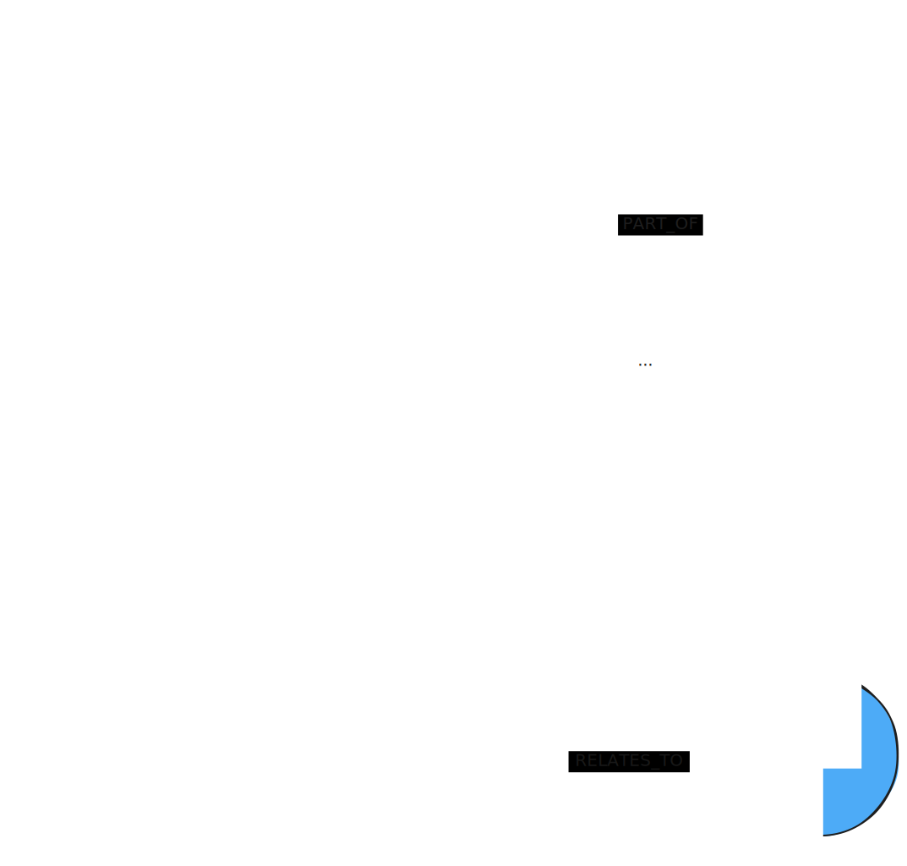

## Alternative Names

- Graph + Vector
- Augmented Vector Search

## Required Graph Shape


[Lexical Graph with Extracted Entities](/reference/knowledge-graph/lexical-graph-extracted-entities/)

## Context

The biggest problem with basic GraphRAG patterns is finding all relevant context necessary to answer a question. 
The context can be spread across many chunks not being found by the search. 
Relating the real-world entities from the chunks to each other and retrieving these relationships together with a vector search provides additional context about these entities that the chunks refer to. 
They can also be used to relate chunks to each other through the entity network.

## Description

The user question is embedded using the same embedder that has been used before to create embeddings. 
A vector similarity search is executed on the Chunk embeddings to find k (number previously configured by developer / user) most similar Chunks. 
A traversal starting at the found chunks is executed to retrieve more context.

## Usage

This pattern is useful for retrieving more enriched context than the results of executing only a vector search as in e.g. [Basic Retrievers](/reference/graphrag/basic-retriever/) or [Parent-Child Retrievers](/reference/graphrag/parent-child-retriever/). 
The additional traversal retrieves the interaction of entities within the provided data which reveals much richer information than the retrieval of specific text chunks. 
Naturally, the preprocessing for this GraphRAG pattern is effort. 
Furthermore, the amount of context that is returned by the Graph Traversal can be much larger context which the LLM needs be able to process.

## Required pre-processing

Use an LLM to execute entity and relationship extraction on the chunks. Import the retrieved triples into the graph.

## Retrieval Query

```cypher
MATCH (node)-[:PART_OF]->(d:Document)
CALL { WITH node
  MATCH (node)-[:HAS_ENTITY]->(e)
  MATCH path=(e)(()-[rels:!HAS_ENTITY&!PART_OF]-()){0,2}(:!Chunk&!Document)
  …
  RETURN …}
RETURN …
```

## Variants

There are some variations of this retriever:

* **Entity disambiguation** — A naive Entity Extraction Pipeline will pull out any entities from texts. However, multiple entities might actually be referred to differently in the text but mean the same real-world entity. To keep the graph clean, an entity disambiguation step can be executed, where these entities are merged. Possible ways of doing this are described in [Implementing ‘From Local to Global’ GraphRAG with Neo4j and LangChain: Constructing the Graph](https://neo4j.com/developer-blog/global-graphrag-neo4j-langchain/) and [Entity Linking and Relationship Extraction With Relik in LlamaIndex](https://neo4j.com/developer-blog/entity-linking-relationship-extraction-relik-llamaindex/).

* **Question-guided/Schema-defined extraction** — Instead of letting the LLM extract any kinds of entities and relationships, provide a set of questions or a fixed schema to guide the LLM to extract only the domain knowledge that is relevant for the application. This approach will narrow down the scope and the volume of the extraction (e.g., [Introducing WhyHow.AI Open-Source Knowledge Graph Schema Library — Start Experimenting Faster](https://medium.com/enterprise-rag/introducing-whyhow-ai-open-source-knowledge-graph-schema-library-start-experimenting-faster-0d836b76efe6)).

* **Entity embeddings** — When extracting the entities and the relationships using an LLM, we can instruct the LLM to also create/extract entity and relationship descriptions. These can be embedded and subsequently be used for the initial vector search and other guidance during traversal.
* **Ontology-driven traversal** — Instead of hard-coding a traversal into your application code, you can provide an ontology for the traversal. This approach is explained in [Going meta — Ep 24: KG+LLMs: Ontology driven RAG patterns](https://www.youtube.com/watch?v=5_WXr0GtVas&list=PL9Hl4pk2FsvX-5QPvwChB-ni_mFF97rCE&index=5).

## Further reading

- [Going Meta - Ep 23: Advanced RAG patterns with Knowledge Graphs](https://www.youtube.com/watch?v=E_JO4-2D5Xs&list=PL9Hl4pk2FsvX-5QPvwChB-ni_mFF97rCE&index=6) (December 2023)

## Existing Implementations

## Example Implementations

- [Neo4j's Knowledge Graph Builder](https://github.com/neo4j-labs/llm-graph-builder/)
