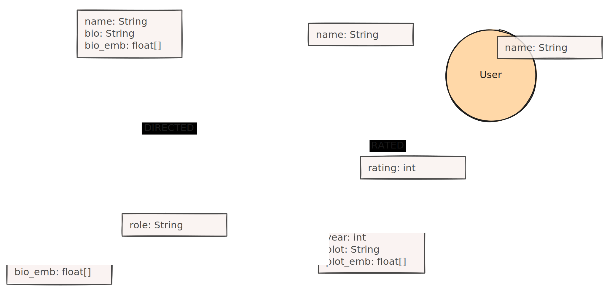

## Required Graph Shape

[Domain Graph](/reference/knowledge-graph/domain-graph/)

## Context

The two related GraphRAG patterns [Cypher Templates](/reference/graphrag/cypher-templates/) and [Dynamic Cypher Generation](/reference/graphrag/dynamic-cypher-generation/) are both limited by the queries / query snippets that are defined during implementation.

## Description

The user question is combined with a graph schema and translated by the LLM to a Cypher query, which is then executed against the database. 
The data returned by the execution is provided to the LLM for question answering.

## Usage

This pattern is highly flexible. 
There are no predefined queries and (in theory) the LLM can generate any query that fits the provided schema. 
However, this pattern is not 100% reliable as it is limited by the Cypher query language understanding of the foundation models. 
This situation can be improved by fine-tuning models for improved generation (see below).
LLMs are not perfect when translating text to Cypher, so there needs to be either a human it the loop (HITL) or appropriate guardrails like syntax checks or read-only execution.
In case of error the question, schema and error can be retried with the LLM for a better result.

## Required pre-processing

The LLM should obtain the database schema together with a description of the domain. 
This will significantly improve the results. 
The schema can be optionally enhanced by actual data value samples, distributions, or lists of categorical values to improve value translation from questions to queries.

## Further Considerations

If we compare [Cypher Templates](/reference/graphrag/cypher-templates/), [Dynamic Cypher Generation](/reference/graphrag/dynamic-cypher-generation/), and Text2Cypher, we could use the following analogy (illustrated in the images below)

* Cypher Templates is like having different similar toys that consist of one piece. There’s not much freedom.
* Dynamic Cypher Generation is like playing with building bricks. There is more freedom in how to put them together, but it is still quite fail-proof.
* Text2Cypher is like painting. There is a lot of freedom, but you can also fail easily.

The above patterns also encounter the same challenge: When extracting the entities from the user question, the entity aliases need to match the existing values in the database or the query will fail to return any results. 
This problem can be mitigated by providing an enhanced schema or by using a full-text index search on the database as in [LangChain Templates: Neo4j Advanced RAG (Neo4j Cypher FT)](https://github.com/langchain-ai/langchain/blob/master/templates/neo4j-cypher-ft/neo4j_cypher_ft/chain.py).

The Text2Cypher pattern is the most flexible, but also the most unreliable. However, there’s a lot of work being done to improve its reliability. Approaches include:

* Fine-tuning LLMs on natural language to Cypher translations (see below)
* Optimizing the use of few-shot examples (e.g., Enhancing text2cypher with In-Context Learning & Fine-Tuning or Improving LLM-based KGQA for multi-hop Question Answering with implicit reasoning in few-shot examples)
* Self-healing generation — if the generated query cannot be executed on the database, return the query together with the obtained exception message to the LLM that gets another chance at generating a better query (e.g., Generating Cypher Queries With ChatGPT 4 on Any Graph Schema)
* The choice of the language model also plays a role in how good the results are since every language model has its own unique strengths and weaknesses. (LLM Query Benchmarks: Cypher vs SQL)

## Schema considerations

To generate correct queries the schema of the database has to be taken into acccount.
That's why it makes sense to provide the LLM with the concrete schema description of the database which the query needs to be generated for.

* nodes (labels and attribute names and types)
* relationships (types and attribute names and types)
* source-relationship->target (relationships between node types)

Information about existing indexes, or constraints can be provided to enable the LLM to make use of them (think vector, fulltext or spatial indexes).

Additionally it can be useful to enhance the schema with additional information on properties.
These can then used by the to properly convert values from the user input or reason about valid ranges or patterns.

* detailed type information
* ranges (min, max) for numerical types
* (sample) list of values (and distribution) for categorical values
* formats and descriptions for attributes

<!-- See [Graph Schema Representation](/concepts/graph-schema) -->

## Fine tuned models

Large foundation models (GPT-4o, Gemini 1.5 Pro, Claude Sonnet 3.6, Llama3.1 70bn+ and Qwen 2.5 Coder) show already quite impressive Cypher pre-training and understanding.

Medium complex Cypher queries can be generated by these models correctly.
They mainly struggle with recent syntax, relationship-direction and unknown attribute types or values.
It helps to add additional information (like the Cypher Reference) or examples from query logs as few-shot examples to improve output quality.

Another step change in improvements can be achieved with fine-tuned models using a curated question-schema-query dataset, see blog posts below.

 
from [Benchmarking Using the Neo4j Text2Cypher (2024) Dataset](https://neo4j.com/developer-blog/benchmarking-neo4j-text2cypher-dataset/)

## Further reading

### Training Datasets

- [Arxiv: SyntheT2C: Generating Synthetic Data for Fine-Tuning Large Language Models on the Text2Cypher Task](https://arxiv.org/abs/2406.10710)
- [Crowdsourcing Text2Cypher dataset](https://bratanic-tomaz.medium.com/crowdsourcing-text2cypher-dataset-e65ba51916d4)
- [Introducing the Neo4j Text2Cypher (2024) Dataset](https://neo4j.com/developer-blog/introducing-neo4j-text2cypher-dataset/)

### Fine Tuning

- (Huggingface: text2cypher training datasets and finetuned models)[https://huggingface.co/neo4j]
- [Introducing the Fine-Tuned Neo4j Text2Cypher (2024) Model - Graph Database & Analytics](https://neo4j.com/developer-blog/fine-tuned-text2cypher-2024-model/)

### Few Shot Examples

- [Video: Neo4j Live: Enhancing text2cypher with In-Context Learning & Fine-Tuning - Graph Database & Analytics](https://neo4j.com/videos/neo4j-live-enhancing-text2cypher-with-in-context-learning-fine-tuning/)
- [Improving LLM-based KGQA for multi-hop Question Answering with implicit reasoning in few-shot examples](https://aclanthology.org/2024.kallm-1.13.pdf)

### Benchmarking

- [Benchmarking Using the Neo4j Text2Cypher (2024) Dataset](https://neo4j.com/developer-blog/benchmarking-neo4j-text2cypher-dataset/)
- [Video LLM Query Benchmarks: Cypher vs SQL](https://www.youtube.com/watch?v=YbJVq8ZOsaM)

## Existing Implementations

- [Integrating Neo4j into the LangChain ecosystem](https://towardsdatascience.com/integrating-neo4j-into-the-langchain-ecosystem-df0e988344d2) (Tomaz Bratanic, April 2024)
- [LangChain Cypher Search: Tips & Tricks](https://neo4j.com/developer-blog/langchain-cypher-search-tips-tricks/) (Tomaz Bratanic, June 2024)

- [Langchain: GraphCypherQAChain](https://python.langchain.com/v0.2/docs/integrations/providers/neo4j/#graphcypherqachain)
- [Neo4j-GraphRAG Text2Cypher Retriever](https://neo4j.com/docs/neo4j-graphrag-python/current/user_guide_rag.html#text2cypher-retriever)
- [LlamaIndex Knowledge Graph Retriever](https://docs.llamaindex.ai/en/stable/examples/query_engine/knowledge_graph_rag_query_engine/#include-nl2graphquery-as-context-in-graph-rag)
