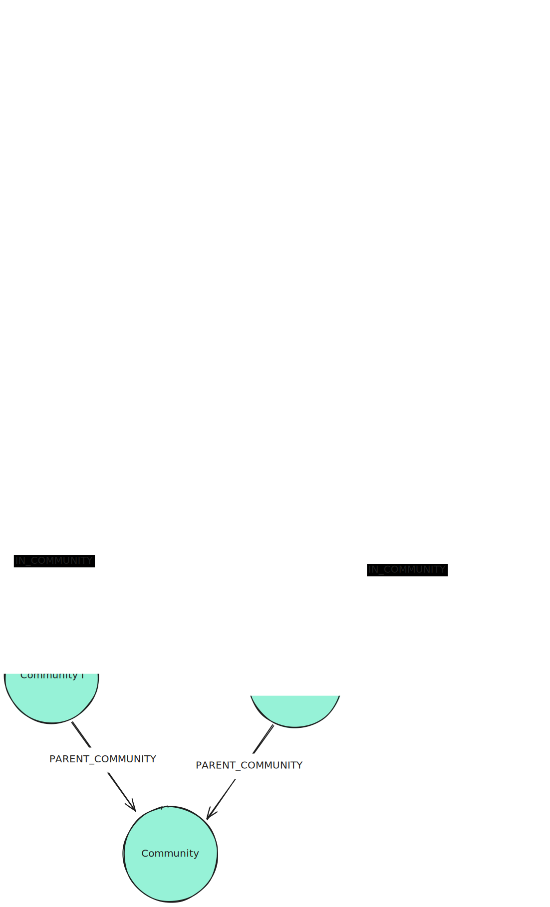
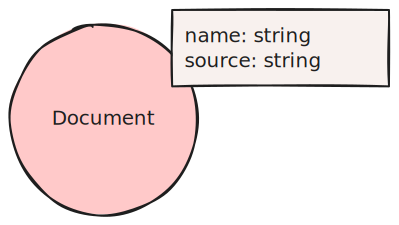
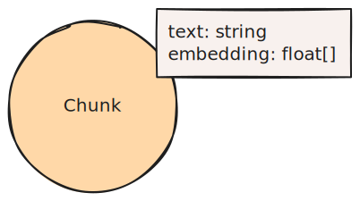
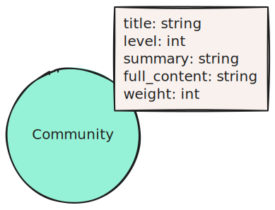

## Context

Certain questions that can be asked on a whole dataset, do not just relate to things that are present in some chunks but rather search for an overall message that is overarching in the dataset. All aforementioned patterns are not suited to answer these kinds of "global" questions.

## Graph Pattern

## Elements

### Nodes

Document nodes contain the document name and its source. They may contain additional metadata.

Chunk nodes contain the human readable text of a chunk and its vector embedding. They may contain additional metadata.

Entity nodes contain the name of the entity. Additionally they might contain a description of the entity and a vector embedding (of name and description). They may contain additional metadata. Entity nodes can have additional labels based on the extraction prompt.

Community nodes contain all data relevant to the community as the level, a name, a summary and the full_content. They may have a weight property which denotes how many chunks this community spans over. They may contain additional metadata.

### Relationships

The PART_OF relationships do not require additional properties. However, they may contain additional metadata.

The HAS_ENTITY relationships do not require additional properties. However, they may contain additional metadata.

The RELATES_TO relationships are examplary here. They can have any type based on the extraction prompt. They may also have a description. They may contain additional metadata.

The IN_COMMUNITY relationships connect entities to a Community Node that contains a summary. The relationships do not require additional properties. However, they may contain additional metadata.

The PARENT_COMMUNITY relationships connects communities of one level to their higher level Community Nodes. The relationships do not require additional properties. However, they may contain additional metadata.

## Description

Additionally to extracting entities and their relationships, we need to form hierarchical communities within the Domain Graph. This can be done by using the Leiden algorithm. For every community, an LLM summarizes the entity and relationship information into Community Summaries.

## GraphRAG Pattern

A Lexical Graph with Extracted Entities and Community Summaries is used in [Global Community Summary Retrievers](/reference/graphrag/global-community-summary-retriever/) and [Local Retrievers](/reference/graphrag/local-retriever/).
