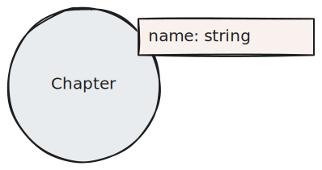
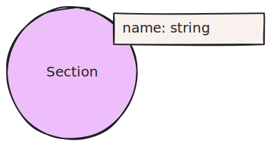
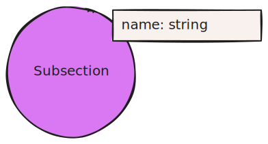

## Context

If the given documents have pre-defined structures, it is useful to persist them into the chunk structure.
This pattern is an evolution of the [Lexical Graph](/reference/knowledge-graph/lexical-graph)

## Graph Pattern

## Elements

### Nodes

Document nodes contain the document name and its source. They may contain additional metadata.

Chunk nodes contain the human readable text of a chunk and its vector embedding. They may contain additional metadata.

Chapter, Section and Subsection nodes contain the name of the Chapter, Section and Subsection, respectively. They may contain additional metadata. These nodes are exemplary for possible hierarchies that can be present in documents.

### Relationships

The PART_OF relationships do not require additional properties. However, they may contain additional metadata.

The HAS_CHAPTER, HAS_SECTION and HAS_SUBSECTION relationships do not require additional properties. However, they may contain additional metadata. These relationships are exemplary for possible hierarchies that can be present in documents.

## Description

When chunking documents, record the hierarchies of the documents.

## GraphRAG Pattern
