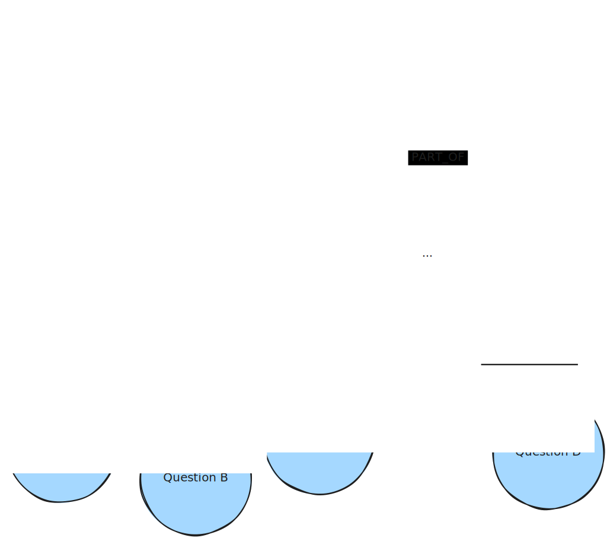
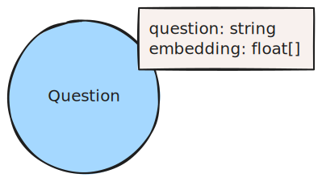

## Context

The vector similarity between a question’s embedding and the text embedding of an appropriate answer might be quite different from each other. If we have question-chunk pairs available, we can execute a vector similarity search on the question embeddings which will probably deliver much better results than a vector similarity search on the chunks.  
This pattern is an evolution of the [Lexical Graph](/reference/knowledge-graph/lexical-graph)

## Graph Pattern

## Elements

### Nodes

Document nodes contain the document name and its source. They may contain additional metadata.

Chunk nodes contain the human readable text of a chunk and its vector embedding. They may contain additional metadata.

Question nodes contain the human readable question and its vector embedding. They may contain additional metadata.

### Relationships

The PART_OF relationships do not require additional properties. However, they may contain additional metadata.

The HAS_QUESTION relationships do not require additional properties. However, they may contain additional metadata.

## Description

Use an LLM to generate hypothetical questions that are answered within the chunks. Embed the question using an embedding model. Record the relationship between questions and the chunk that contains their answer.

## GraphRAG Pattern

A Lexical Graph with Hypothetical Questions is used in [Hypothetical Question Retrievers](/reference/graphrag/hypothetical-question-retriever).
