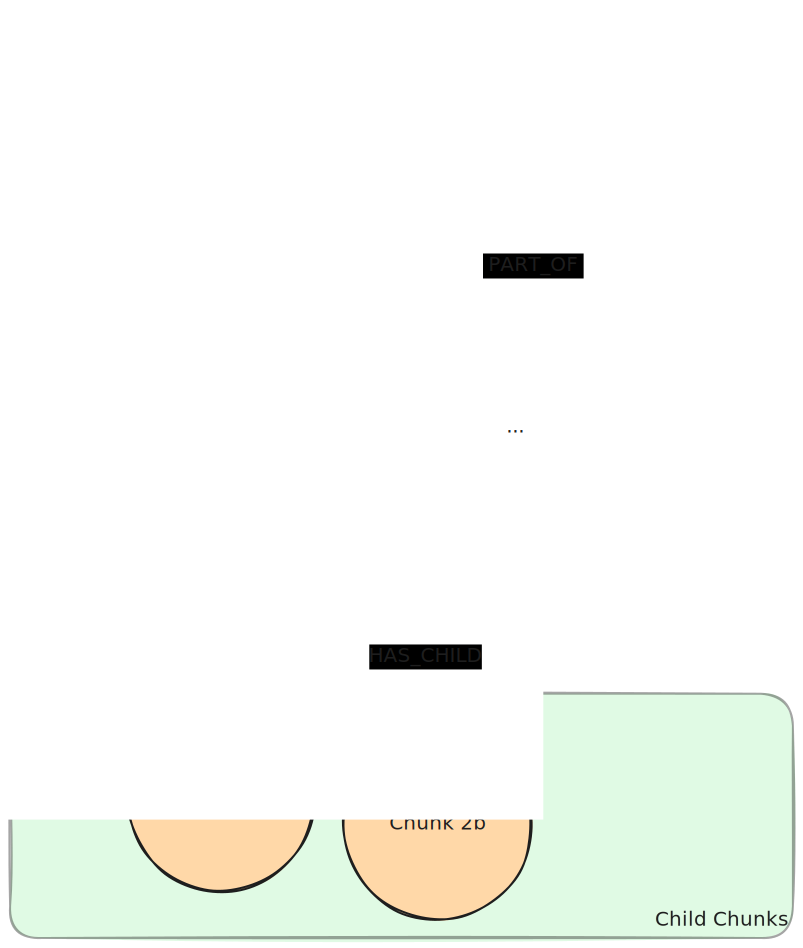

## Context

It is useful to chunk large documents into smaller pieces for creating embeddings. An embedding is a text’s semantic representation capturing the meaning of what the text is about. If the given text is long and contains too many diverse subjects, the informative value of its embedding deteriorates.
A more narrow piece of text will yield a more meaningful vector representation than a broader one since there is less noise from multiple topics. However if the LLM only receives a very small piece of information for answer generation, the information might be missing context. Retrieving the broader piece of text that the found information resides in solves the problem.  
This pattern is an evolution of the [Lexical Graph](/reference/knowledge-graph/lexical-graph/)

## Graph Pattern

## Elements

### Nodes

Document nodes contain the document name and its source. They may contain additional metadata.

Chunk nodes contain the human readable text of a chunk and its vector embedding. They may contain additional metadata.

### Relationships

The PART_OF relationships do not require additional properties. However, they may contain additional metadata.

The HAS_CHILD relationships do not require additional properties. However, they may contain additional metadata.

## Description

When chunking documents, split them into (bigger) chunks (aka Parent Chunks) and further split these chunks into smaller chunks (aka Child Chunks). Use an embedding model to embed the text content of the Child Chunks. Note, it is not necessary to embed the Parent Chunks since they are only used for the answer generation and not for the similarity search.

## GraphRAG Pattern

A Parent-Child Lexical Graph is used in [Parent-Child Retrievers](/reference/graphrag/parent-child-retriever/).
