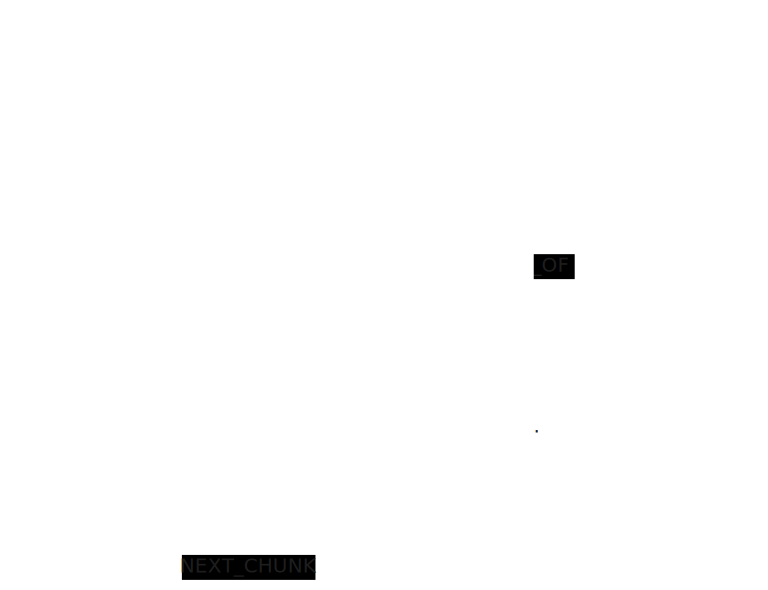

## Context

It is useful to keep track of adjacent chunks for a possible retrieval of them.
This pattern is an evolution of the [Lexical Graph](/reference/knowledge-graph/lexical-graph/)

## Graph Pattern

## Elements

### Nodes

Document nodes contain the document name and its source. They may contain additional metadata.

Chunk nodes contain the human readable text of a chunk and its vector embedding. They may contain additional metadata.

### Relationships

The PART_OF relationships do not require additional properties. However, they may contain additional metadata.

The FIRST_CHUNK relationships do not require additional properties. However, they may contain additional metadata.

The NEXT_CHUNK relationships do not require additional properties. However, they may contain additional metadata.

## Description

When chunking documents, record the adjacency relationships between the chunks.

## GraphRAG Pattern
