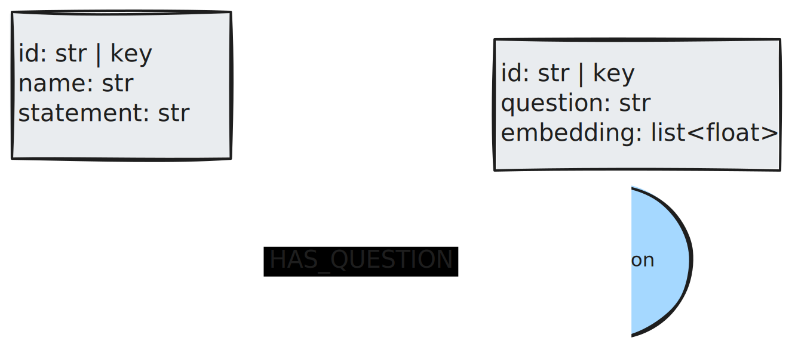
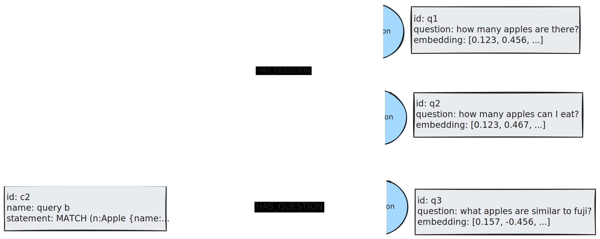

## Episodic Memory

Episodic memory stores remembered experiences. These contain information about event details and past agent actions. A common use case for this type of memory is in few-shot prompting. Previous question-answer pairs are stored in the graph and retrieved to provide examples in the prompt. Performing a similarity search between the user query and questions in the database accomplishes this.

The image below shows a graph data model that stores user questions and the Cypher query used to retrieve the data. Using similarity search and a simple graph traversal, we can retrieve the top k most relevant examples from the database and inject them into the prompt to inform novel Cypher generation.

Here’s an example of how this may look in practice. A possible retrieval method is to perform a similarity search against the question embeddings in the database and then traverse to the associated Cypher queries. The top k question texts and Cypher query statements are returned and formatted into a few-shot examples.

*A Cypher query may have many questions. This is because some user questions may differ in explicit text but have the same semantic meaning.*

The process of updating these memories may look like this:

* The agent generates a Cypher query to retrieve information from a Neo4j database.
* The user rates the returned result from the agent as good or bad.
* Positive feedback kicks off a process that writes the Cypher query and question to the database to use for future examples.

Episodic memory is better written in the background once user feedback is received. This prevents bad or unhelpful memories from being included, which would ultimately diminish performance.

## Further reading

* [Modeling Agent Memory](https://medium.com/neo4j/modeling-agent-memory-d3b6bc3bb9c4)
* [LangGraph Memory](https://langchain-ai.github.io/langgraph/concepts/memory/)