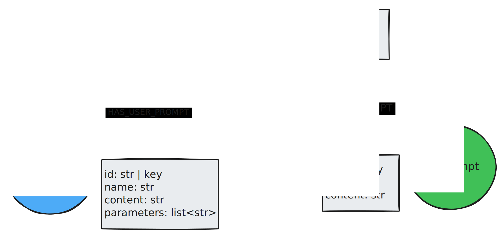
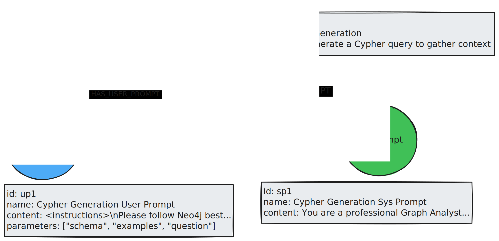

## Procedural Memory Graph

Procedural memory stores how to do something. In real life, this type of memory helps us write with a pen or play guitar without thinking about the explicit actions. Through practice, these actions have become internalized in our brains, and we no longer have to think about how to perform them.

For AI systems, procedural memory is a combination of the model weights, code, and prompts. Since the prompts are most accessible to us, this type of memory is commonly used to store system prompts, tool descriptions, and instructions. These memories may then be updated in a feedback loop from either the end user or another system, such as an LLM-as-a-judge. Just as we learned to write through practice and feedback, an agent can learn a task by refining its internal set of instructions.

Here, the graph data model stores information about prompts. It contains both system and user prompts for a particular use case.

This is how the data may look for a Text2Cypher agent. A possible retrieval strategy is to retrieve these prompts anytime a new chat session is started. This ensures that any updates made since the previous session are implemented.

Note the difference between episodic and procedural memory. In the Cypher generation example, episodic memory is recalling the explicit question and Cypher pairs, whereas procedural memory is recalling how the Cypher is generated.

The process of updating these memories may look like this:

* A series of prompt, answer, and feedback triples are collected as input.
* An LLM takes this series and generates a new prompt that adheres to the provided feedback.
* This new prompt is written into the database.

Procedural memory also lends itself well to being written in the background once feedback is received. In the example of improving prompts, it is probably best to wait until many feedback responses are received so the LLM performing the improvement can align with a more representative sample of the user base.

## Further reading

* [Modeling Agent Memory](https://medium.com/neo4j/modeling-agent-memory-d3b6bc3bb9c4)
* [LangGraph Memory](https://langchain-ai.github.io/langgraph/concepts/memory/)