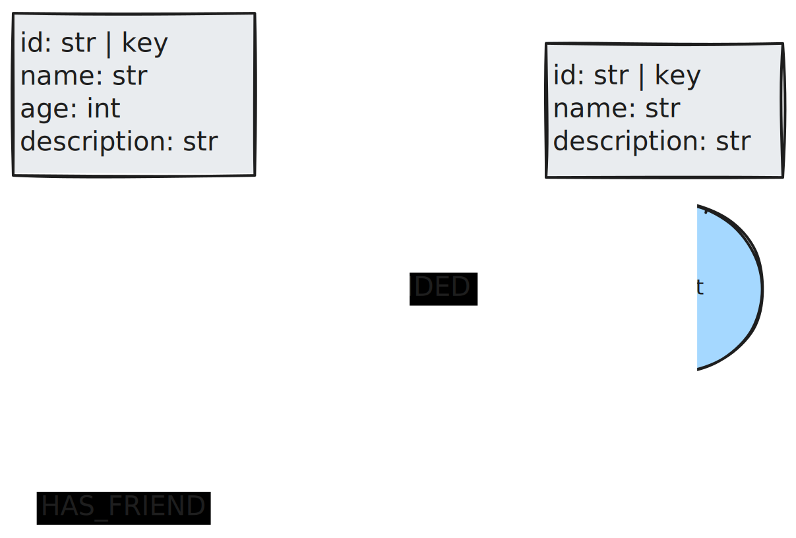
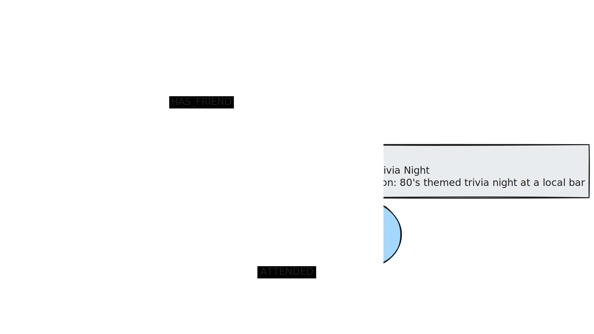

## Semantic Memory Graph

Semantic memory contains facts about the world. For an agent, this can be information about the user, such as name, age, or relationships to other people. This could also take the form of a collection of documents used in a RAG pipeline. This type of memory requires information to be properly maintained and can change frequently, which leads to complexity in creating, updating, and deleting memories appropriately.

Below is a possible graph data model that contains information about a user profile. In this data model, we also can track the relationships a user has with other users, as well as events they attended.

Here’s an example of how this may look in practice. Information about the current user may be retrieved dynamically according to the input question. For example, if the question requires knowledge about what the user does for fun, a query may be used to grab information about events they’ve attended.

The process of updating these memories may look like this:

* Prepare entities or unstructured text from the conversation to be written as a memory.
* Search for the top k memories in the database that are similar to the incoming prepared data.
* Identify if there is new or conflicting information in the user query.
* Update the existing memories with new nodes or values.
* Create or delete relationships.

Semantic memory lends itself well to being updated in the hot path. This prevents the agent from communicating out-of-date information to the user. Since this data is typically used in a RAG pipeline, it poses a risk of delayed writing in the future.

## Further reading

* [Modeling Agent Memory](https://medium.com/neo4j/modeling-agent-memory-d3b6bc3bb9c4)
* [LangGraph Memory](https://langchain-ai.github.io/langgraph/concepts/memory/)
