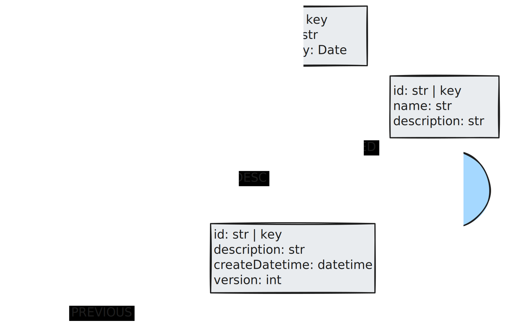
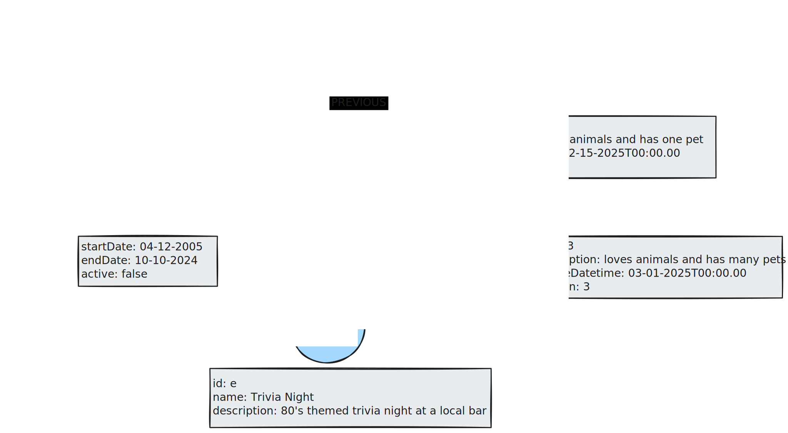
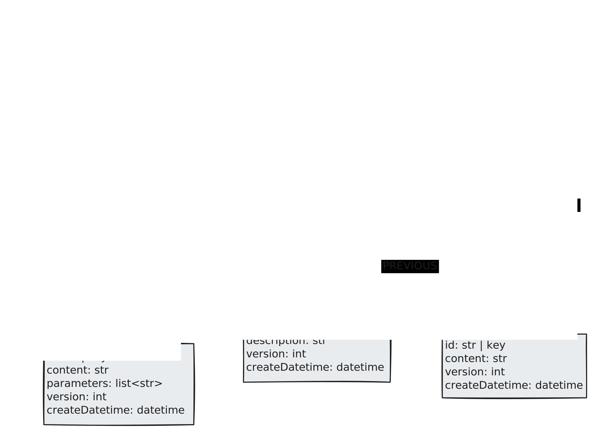

## Temporal Memory Graph

Temporal memory stores how data changes over time. This can apply to any other memory type and allows the agent to be aware of how things have changed. In the example of storing the semantic memory of a user profile, we can implement temporal memory in a few ways. One is by including timestamps on `HAS_FRIEND` relationships with other users to identify the beginning and end of personal relationships. The other is implementing a `PREVIOUS` relationship between nodes we want to maintain versions of. In the example below, we’ll pull out the user description into its own `UserDescription` node, which can be tracked in this manner. The image below shows the updated user profile data model that incorporates semantic and temporal memory.

We see an applied version of this data where the user description has been updated over several months. Notice that the `User` node only has a `HAS_CURRENT_DESC` relationship with the most up-to-date `UserDesc`. This makes retrieval easier. We also see that Bob used to be friends with Alice until recently.

Another example would be tracking prompt versions with the procedural memory type. Here, we have a primary prompt node with the prompt name. It’s connected to a sequence of `UserPromptDetails` or `SysPromptDetails` nodes with a `PREVIOUS` relationship to the most recent version. This allows the prompt to be retrieved while allowing previous versions to be easily accessible for auditing or reverting changes.

We can see the applied version of this data model for a Text2Cypher agent, where changes in prompt content and parameters are easily accessible.

## Further reading

* [Modeling Agent Memory](https://medium.com/neo4j/modeling-agent-memory-d3b6bc3bb9c4)
* [LangGraph Memory](https://langchain-ai.github.io/langgraph/concepts/memory/)