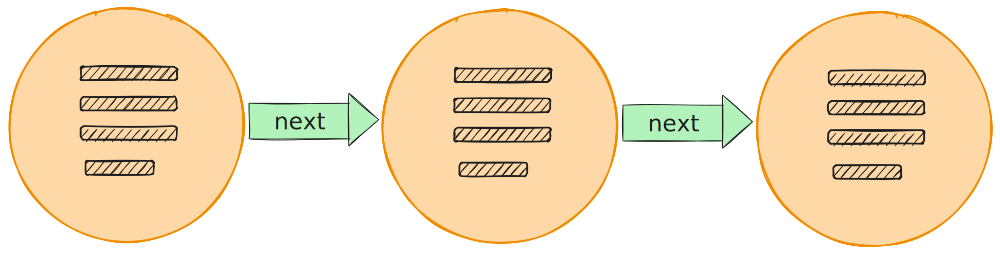
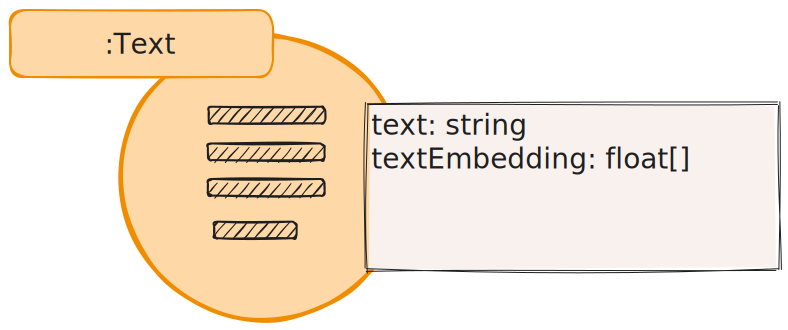
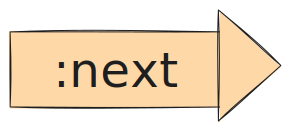

A text sequence is a lexical graph pattern derived from an unstructured source document
that has been split into multiple texts.

## Graph Pattern



## Elements

### Nodes



```
(:Text { text::string, textEmbedding::float[], source::string? } )
```

`Text` nodes contain original source text along with an embedding. They may also have additional
metadata like a source reference.

### Relationships



```
(1)=[:NEXT]=>(1)
```

`NEXT` relationships form a linked list.


## See also

- [Lexical Graph](/reference/knowledge-graph/lexical-graph)
