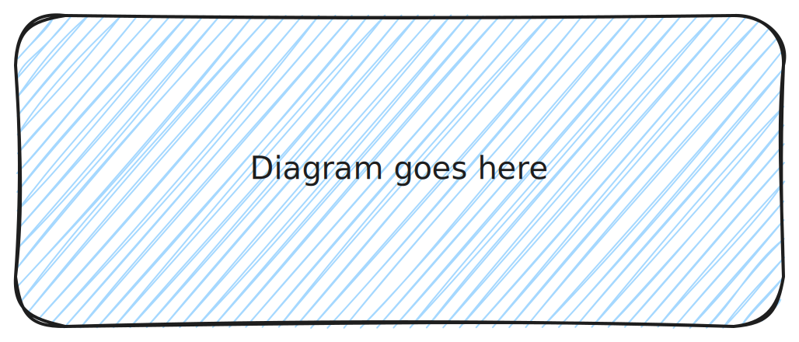

<!-- Diagram -->

**Instructions**: 

1. Create a diagram using https://excalidraw.com
2. Save the Excalidraw file in `/media`
3. Save an SVG export of the diagram in `/src/assets/images`
4. Link to it above using a relative path

## About (Reference)

**Instructions**: 

1. Write a brief overview of at most 3 paragraphs, about the size of a LinkedIn post

Reference material is ideal for outlining how things work in terse and clear terms.
Less concerned with telling a story or addressing a specific use case, they should give a comprehensive outline of what you're documenting.

Reference material describes what something is.

## Detailed (How-to)

**Instructions**: 

1. Add extra sections with step-by-step directions
2. Avoid implementation specific details (programming language or framework -specific)

**Further reading**:

**Instructions**:

1. Provide links to external sources
2. Don't keep the link below, it's for your reference as the author

- Read [about reference](https://diataxis.fr/reference/) in the Diátaxis framework
